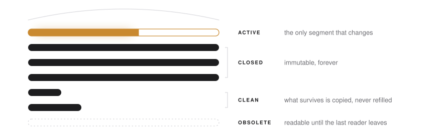
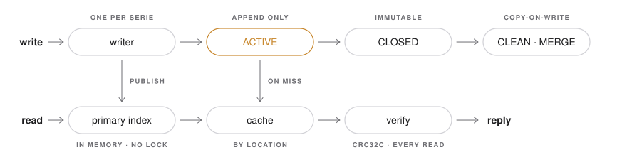

<p align="center">
  <picture>
    <source media="(prefers-color-scheme: dark)" srcset="assets/img/mark-dark.svg">
    
  </picture>
</p>

<h1 align="center">ArcDocDB</h1>

<p align="center">
  A document database that never overwrites,<br>
  and never answers wrong in silence.
</p>

<p align="center">
  <a href="LICENSE"></a>
  <a href="docs/adr/0001-common-lisp-sbcl.md"></a>
  <a href="https://www.sbcl.org/"></a>
  <a href="docs/adr/0027-dipendenze-e-test.md"></a>
  <a href="docs/roadmap.md"></a>
</p>

<p align="center">
  <a href="#the-idea">Idea</a> ·
  <a href="#how-it-works">How it works</a> ·
  <a href="#decisions">Decisions</a> ·
  <a href="#reliability">Reliability</a> ·
  <a href="#limits">Limits</a> ·
  <a href="#status">Status</a> ·
  <a href="docs/README.md">Documentation</a>
</p>

<br>

<p align="center">
  <picture>
    <source media="(prefers-color-scheme: dark)" srcset="assets/img/hero-dark.svg">
    
  </picture>
</p>

## The idea

<table>
  <tr>
    <td width="33%" valign="top">
      <strong>Nothing is overwritten.</strong><br><br>
      Every record is appended once. A closed segment never changes again, so a crash
      cannot damage what was already written.
    </td>
    <td width="33%" valign="top">
      <strong>One writer per Serie.</strong><br><br>
      A Serie owns its log, its segments, its indexes. Serie write in parallel.
      Readers take no lock and never wait.
    </td>
    <td width="33%" valign="top">
      <strong>Nothing unverified leaves.</strong><br><br>
      Every record is checked on every read. A write that fails stops the Serie
      instead of guessing.
    </td>
  </tr>
</table>

ArcDocDB is a general-purpose document engine, written in Common Lisp and engineered as
safety-critical software. Reliability comes first; performance follows from the layout
rather than from shortcuts.

## How it works

<p align="center">
  <picture>
    <source media="(prefers-color-scheme: dark)" srcset="assets/img/flow-dark.svg">
    
  </picture>
</p>

```
Server
└── Archivio          commit order · snapshots · multi-Serie transactions
    ├── Registri      the catalog, itself a Serie
    └── Serie         one writer · its own log, segments, indexes
        └── Documento opaque, versioned, under a unique _id
```

The complete design is one document: [architettura.md](docs/architettura.md).

## Decisions

Each is the best known pattern for its problem, chosen once, before the code.

| | Decision | Record |
|---|---|---|
| Laws | Parallelism is foundational. One atomic point per operation. Prepare, decide, complete. Nothing is destroyed by absence. | [0036](docs/adr/0036-leggi-di-progetto.md) |
| Storage | The ACTIVE segment is the log. Each record is written once, in sealed batches. | [0013](docs/adr/0013-log-structured-segmento-active-come-log.md) · [0037](docs/adr/0037-lotto-sigillato.md) |
| Index | A directory of small flat hash tables in memory: one writer, lock-free readers. | [0043](docs/adr/0043-primary-index-a-frammenti.md) · [0032](docs/adr/0032-seqlock-a-64-bit.md) |
| Secondary indexes | One immutable, fixed-format file per segment. | [0026](docs/adr/0026-indici-secondari-segmentati.md) |
| Durability | Group commit by default. The writer never waits for a flush. | [0019](docs/adr/0019-durability-e-group-commit-pipelined.md) · [0037](docs/adr/0037-lotto-sigillato.md) |
| Snapshots | One commit sequence per Archivio; it is also the document version. A snapshot is born when everything below it is visible. | [0020](docs/adr/0020-csn-snapshot-isolamento.md) · [0038](docs/adr/0038-orizzonte-di-visibilita.md) |
| Transactions | Two-phase commit across Serie, with a writer that never blocks. | [0021](docs/adr/0021-2pc-intenti-outcome.md) · [0041](docs/adr/0041-multiserie-segmenti-autosufficienti.md) |
| Compaction | Copy-on-write. The swap is a single log record. | [0040](docs/adr/0040-manifest-a-record-unico.md) · [0023](docs/adr/0023-politiche-di-compaction.md) · [0042](docs/adr/0042-tombstone-e-indice-dei-vivi.md) |
| Integrity | Fail-stop on any write error. Verification on every read. Recovery never truncates. | [0033](docs/adr/0033-fail-stop-e-integrita-end-to-end.md) · [0039](docs/adr/0039-cornice-unica-dei-record.md) |
| Code | Checks always on. No warnings. No dependencies. | [0034](docs/adr/0034-policy-di-compilazione-e-standard-di-codifica.md) · [0027](docs/adr/0027-dipendenze-e-test.md) |

All forty-five are in the [decision log](docs/adr/README.md); the reasoning that ties them
together is the [design analysis](docs/analisi-progettuale.md).

## Reliability

Priorities, in order. A lower one never weakens a higher one.

**Integrity of committed data · Correctness · Defined behaviour under faults · Verifiability · Availability · Performance**

| The design guarantees | Checked by |
|---|---|
| No committed datum is lost or corrupted without being detected and declared. | Fault injection, protocol models, offline verifier |
| No wrong answer is given in silence. | Verification on read, corruption tests, fuzzing |
| Every fault in the [fault model](docs/affidabilita/analisi-dei-guasti.md) has a defined, tested response. | Twenty-seven failure modes, each traced to a test |
| Every requirement is traced to its verification. | A [matrix](docs/tracciabilita/matrice.md) generated and checked by a tool |

It does not promise the impossible. It cannot survive the loss of every copy of the data,
a disk that lies about a flush, or a defect in the compiler. Those are stated, and made
detectable where they can be: see the [assurance case](docs/affidabilita/README.md).

## Limits

| | |
|---|---|
| `_id` | 1 to 255 bytes |
| Document | up to 16 MiB |
| Segment | up to 4 GiB · 256 MiB by default |
| Documents per server | about 650 million per 64 GB of memory (estimate) |

Every limit and where it comes from: [limiti.md](docs/limiti.md).

## Status

[](https://github.com/gpicchiarelli/ArcDocDB/actions/workflows/ci.yml)

**Phase 0 — architecture.** The design is complete. There is no production code yet, on purpose.

| | |
|---|---|
| Done | Specification · architecture · design analysis · on-disk formats · 45 decisions · 64 invariants · 107 traced requirements |
| Next | Nine [experiments](docs/valutazione/piano-spike.md) that confirm or replace the quantitative assumptions |
| Then | Ten implementation phases, each closed by a verification gate: the [roadmap](docs/roadmap.md) |

Every performance figure in this repository is a target or an estimate, never a result.

## Quick start

SBCL is the only requirement.

```bash
git clone https://github.com/gpicchiarelli/ArcDocDB.git
cd ArcDocDB
make check
```

`make check` builds with every warning treated as an error, runs the tests and the linter,
verifies the traceability matrix and every link in the documentation.

## Repository

| | |
|---|---|
| [`docs/`](docs/README.md) | Specification, architecture, decisions, reliability, traceability. Written in Italian. |
| [`src/`](src) · [`tests/`](tests) | The system. Minimal until Phase 1. |
| [`spikes/`](spikes/README.md) | Disposable experiments. |
| [`tools/`](tools) | Build, linter, traceability and link checkers, in Common Lisp. |
| [`assets/`](assets/README.md) | The design language. |

To contribute, read [CONTRIBUTING.md](CONTRIBUTING.md).

<br>

<p align="center">
  <sub><a href="LICENSE">BSD 2-Clause</a> · Giacomo Picchiarelli</sub>
</p>
