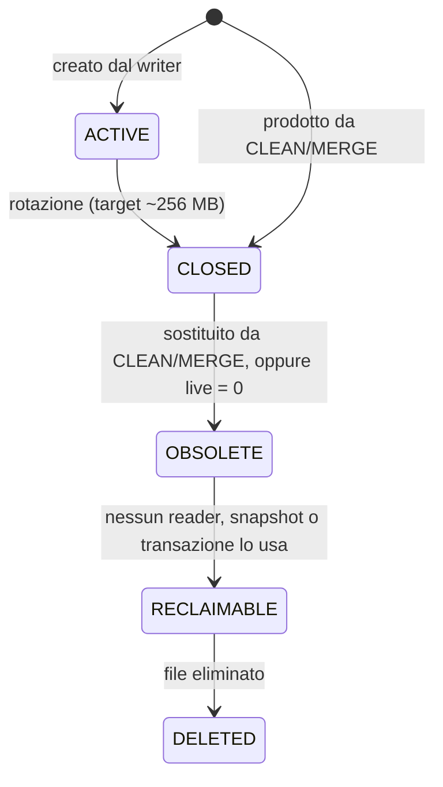

# 03 — Storage

> **Fonte:** «Storage append-only», «Segmenti», «Segment metadata», «Versioni dei record» della
> [specifica](specifica/prompt-originale.md).
> **Moduli:** M01 Storage Engine, M03 Segment Manager, M04 Segment Metadata Manager.
> **Decisioni:** [ADR-0013](adr/0013-log-structured-segmento-active-come-log.md) (il segmento
> ACTIVE è il log dei dati), [ADR-0014](adr/0014-formato-record-documento-id.md) (record),
> [ADR-0018](adr/0018-control-log-manifest-swap.md) (manifest e stati). Formati in
> [formati-su-disco.md](formati-su-disco.md#segmento).

## Append-only

Lo storage di una Serie è append-only: i record già scritti nei segmenti NON DEVONO essere
modificati in-place (INV-S1). Aggiornare un documento significa scriverne una nuova versione;
eliminarlo significa scrivere un tombstone. Le versioni precedenti restano su disco finché la
[compaction](07-compaction.md) non le recupera.

## Il segmento ACTIVE

Per ogni Serie esiste **esattamente un** segmento `ACTIVE`, ed è l'unico mutabile (INV-S2,
INV-S3).

Quando un segmento smette di essere ACTIVE:

- diventa immutabile;
- non può più essere riaperto in scrittura;
- non può più ricevere nuovi record (INV-S4).

Le nuove scritture vanno sempre in un nuovo segmento ACTIVE (INV-S5).

## Dimensione dei segmenti

- Target/massimo normale per un segmento **creato dal writer**: circa **256 MB**, configurabile
  per Serie.
- Il limite vale solo per la normale creazione da parte del writer. I segmenti prodotti dalla
  compaction **non** hanno requisiti di dimensione.

Esempio dalla specifica:

```
S017 = 256 MB (live 20 MB, dead 236 MB)
  ↓ CLEAN
S042 = 20 MB, immutabile

nuove scritture
  ↓
S043 = ACTIVE          ← mai «riempire» S042 fino a 256 MB
```

## Stati del segmento

```
ACTIVE → CLOSED → OBSOLETE → RECLAIMABLE → DELETED
```

| Stato | Scrivibile | Leggibile | Significato |
|---|---|---|---|
| `ACTIVE` | sì | sì | l'unico segmento che riceve scritture |
| `CLOSED` | no | sì | immutabile, referenziato dall'indice corrente |
| `OBSOLETE` | no | sì | sostituito dalla compaction; ancora leggibile da reader/snapshot già attivi |
| `RECLAIMABLE` | no | — | nessuno lo usa più; in attesa di eliminazione |
| `DELETED` | — | — | file eliminato |



Le transizioni sono a senso unico: nessuno stato torna ad ACTIVE.

> **Proposta** — La specifica non nomina lo stato di un segmento prodotto dalla compaction.
> Poiché nasce immutabile, viene qui trattato come `CLOSED` dal momento dello swap. Prima dello
> swap il file è in costruzione e non è visibile (INV-C7): non è uno stato del modello, ma un
> file temporaneo che il recovery può scartare.

> **Proposta** — Per `live = 0` la specifica prevede «DELETE direttamente». Qui si intende:
> nessuna copia e nessun segmento di output, ma il segmento attraversa comunque
> `OBSOLETE → RECLAIMABLE → DELETED`, così le condizioni di reclaim (INV-R1) sono verificate in
> un solo punto.

## Segment metadata

Ogni segmento ha metadata almeno per:

| Campo | Descrizione |
|---|---|
| `segment-id` | identificatore del segmento |
| `record-count` | numero totale di record |
| `live-records` / `dead-records` | conteggio per classificazione |
| `total-bytes` / `live-bytes` / `dead-bytes` | dimensioni per classificazione |
| stato | uno degli stati sopra |
| creation time | istante di creazione |
| close time | istante di chiusura (riferimento per la regola dei 50 s, vedi [07](07-compaction.md)) |
| versione/epoch | eventuale |
| riferimenti | quanto serve a recovery e gestione degli snapshot |

I metadata sono **dati derivati (cache)** e NON DEVONO essere l'unica fonte di verità (INV-S6).
Devono poter essere ricostruiti, verificati e corretti a partire da WAL, dati e indice.

Conseguenza pratica: un contatore `dead-bytes` sbagliato può far scegliere male un candidato
alla compaction, ma non può mai causare perdita di dati, perché la decisione su quali record
copiare si basa su indice e snapshot, non sui contatori.

## Classificazione delle versioni

| Classe | Definizione |
|---|---|
| `LIVE` | versione raggiungibile dall'indice corrente |
| `SNAPSHOT-LIVE` | non più corrente, ma ancora necessaria a uno snapshot attivo |
| `DEAD` | né l'indice corrente né alcuno snapshot attivo possono raggiungerla |

Un record `DEAD` può essere reclamato solo quando non esistono più riferimenti da:

- indice corrente;
- snapshot attivi;
- transazioni che necessitano quella versione.

La classificazione è dinamica: una versione `LIVE` diventa `SNAPSHOT-LIVE` o `DEAD` quando il
documento viene aggiornato, e `SNAPSHOT-LIVE` diventa `DEAD` quando l'ultimo snapshot che la
vede termina.

> **Aperto (QA-15)** — Un tombstone è a sua volta un record: la specifica non dice quando può
> essere scartato dalla compaction.

## Punti aperti che toccano lo storage

- **QA-01** — formato dei record (intestazione, checksum, codifica del documento).
- **QA-02** — rapporto tra WAL e segmenti: il dato viene scritto due volte, oppure il segmento
  ACTIVE viene alimentato in modo che il WAL sia troncabile presto?
- **QA-04** — dove è registrato in modo autorevole l'insieme dei segmenti di una Serie (manifest).
