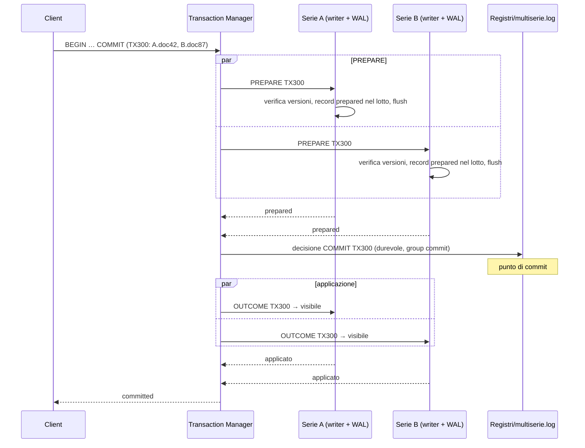

# 05 — Transazioni

> **Fonte:** «Transazioni single-series», «Transazioni multiserie» della
> [specifica](specifica/prompt-originale.md).
> **Moduli:** M09 Transaction Manager, M10 Multiseries Transaction Log Manager.
> **Decisioni:** [ADR-0020](adr/0020-csn-snapshot-isolamento.md) (CSN, isolamento),
> [ADR-0038](adr/0038-orizzonte-di-visibilita.md) (la versione è il CSN; orizzonte),
> [ADR-0021](adr/0021-2pc-intenti-outcome.md) (intenti no-wait, presumed abort),
> [ADR-0041](adr/0041-multiserie-segmenti-autosufficienti.md) (segmenti autosufficienti,
> conferma dopo la pubblicazione). Flussi in [architettura.md](architettura.md#transazioni).

Esistono due percorsi distinti. Quale si applica dipende solo da quante Serie la transazione
**modifica**.

| | Single-Series | Multiserie |
|---|---|---|
| Serie modificate | 1 | ≥ 2 |
| Log usati | solo il WAL della Serie | WAL di ogni Serie partecipante + `Registri/multiserie.log` |
| Coordinamento | writer logico della Serie | protocollo 2PC-like |
| Rilevazione conflitti | optimistic version checking | (vedi QA-07) |

## Transazioni single-Series

Una transazione che coinvolge una sola Serie:

- usa esclusivamente il WAL della Serie;
- NON scrive su `multiserie.log` (INV-T1);
- è serializzata dal writer logico della Serie;
- usa optimistic version checking per i conflitti sullo stesso documento.

```
doc42 = version 18
TX101 legge v18
TX102 legge v18
TX101 commit → v19
TX102 verifica expected-version = 18 → conflitto → abort/retry
```

> **Deciso ([ADR-0038](adr/0038-orizzonte-di-visibilita.md), emenda l'esempio)** — La
> versione di un documento è il **CSN** del commit che l'ha prodotta: i numeri crescono ma non
> sono consecutivi (non `v18 → v19`, ma ad esempio `1042 → 1077`). `expected-version` è un
> CSN; zero significa «il documento non deve esistere». Un CSN non si ripete nemmeno dopo
> l'eliminazione del documento (INV-M5).

Il controllo della versione DEVE essere **atomico rispetto all'applicazione della modifica** da
parte del writer della Serie (INV-T2). Poiché il writer è l'unico a mutare la Serie, «verifica
e applica» eseguiti dentro il writer sono atomici per costruzione, senza lock per documento.

> **Deciso (QA-09 → [ADR-0020](adr/0020-csn-snapshot-isolamento.md))** — La specifica parla di conflitti «sullo stesso documento» (write-write).
> Non definisce il livello di isolamento risultante (snapshot isolation? validazione anche del
> read-set?) né il comportamento rispetto al write skew.

## Transazioni multiserie

Una transazione che modifica documenti di più Serie è multiserie. Tutte le sue modifiche
condividono **un unico TXID** (INV-T5).

### Protocollo

Equivalente a un two-phase commit:

1. `BEGIN`
2. `PREPARE` sui partecipanti
3. flush/fsync dei WAL partecipanti secondo il livello di durability
4. registrazione durevole della decisione in `multiserie.log`
5. `COMMIT` oppure `ABORT`
6. applicazione/visibilità della decisione sui partecipanti



> **Deciso ([ADR-0041](adr/0041-multiserie-segmenti-autosufficienti.md))** — Il client riceve
> `committed` **dopo** che l'esito è stato applicato in memoria su tutti i partecipanti
> (INV-V5), così ogni lettura successiva alla conferma vede la transazione. Il punto di commit
> resta la decisione durevole. Non esiste un record PREPARE: i record prepared sono resi
> atomici dal SEAL del loro lotto.

**Punto di commit.** La decisione `COMMIT` DEVE essere durevole in `multiserie.log` prima che
la transazione sia considerata definitivamente committed (INV-T3). Prima di quel momento la
transazione può ancora abortire; dopo, DEVE essere completata su tutti i partecipanti, anche
attraverso un crash (INV-T4).

Se un partecipante non riesce a preparare (conflitto di versione, errore), la decisione è
`ABORT`.

### `multiserie.log`

- È il *transaction decision log*: registra decisioni, **non dati**. I dati stanno nei WAL
  delle Serie.
- Un solo file per Archivio, in `Registri/` (INV-W2). Nessun file per transazione.
- Contiene solo decisioni COMMIT: con *presumed abort* un abort non si registra
  ([ADR-0041](adr/0041-multiserie-segmenti-autosufficienti.md)).
- Usa group commit dove appropriato.
- NON è un global data WAL (INV-W1).

### Recovery

Dopo un crash il Recovery Manager:

1. legge `multiserie.log`;
2. identifica le transazioni preparate/incomplete;
3. determina la decisione definitiva;
4. completa il `COMMIT` o l'`ABORT` sui WAL delle Serie partecipanti.

> **Deciso ([ADR-0021](adr/0021-2pc-intenti-outcome.md))** — Regola di decisione in recovery (*presumed abort*): una transazione che risulta
> PREPARED in uno o più WAL ma **non** ha una decisione `COMMIT` durevole in `multiserie.log`
> viene abortita. È l'unica regola coerente con INV-T3: senza decisione durevole la transazione
> non è mai stata committed, quindi nessun client può averne ricevuto conferma.

## Questioni decise e rischi

La parte multiserie è quella dove la specifica lascia più gradi di libertà, ed è tra i temi
principali della [valutazione](valutazione/analisi-critica.md).

- **QA-06** ([ADR-0020](adr/0020-csn-snapshot-isolamento.md)) — Chi assegna il TXID e come si ottiene un ordine di commit a livello di Archivio,
  necessario per uno snapshot multiserie coerente.
- **QA-07** ([ADR-0021](adr/0021-2pc-intenti-outcome.md)) — Che cosa vedono reader e scrittori concorrenti su un documento in stato PREPARED,
  tra il prepare e la decisione. Il writer della Serie non può fermarsi ad aspettare la
  decisione, altrimenti l'intera Serie si blocca (contro INV-P3).
- **QA-08** ([ADR-0021](adr/0021-2pc-intenti-outcome.md)) — Quando una decisione può essere dimenticata e come si tronca `multiserie.log`.
- **QA-09** ([ADR-0020](adr/0020-csn-snapshot-isolamento.md)) — Livelli di isolamento.
- Rischi collegati: RSK-05, RSK-06 nel [registro rischi](valutazione/registro-rischi.md).
